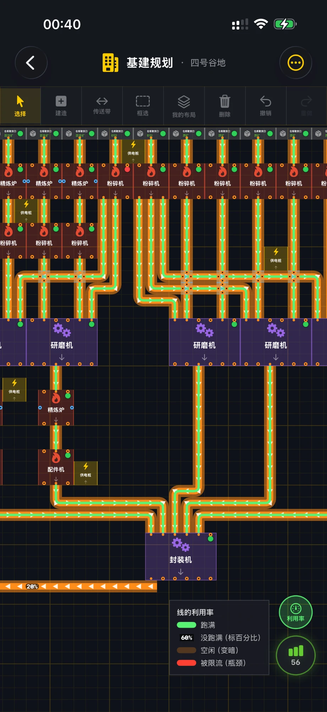
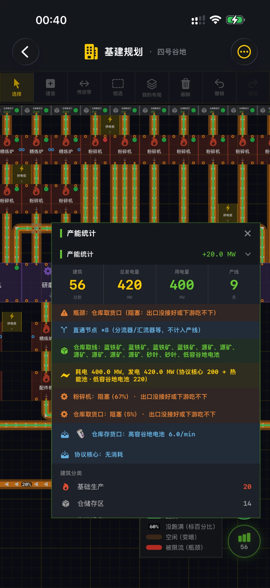
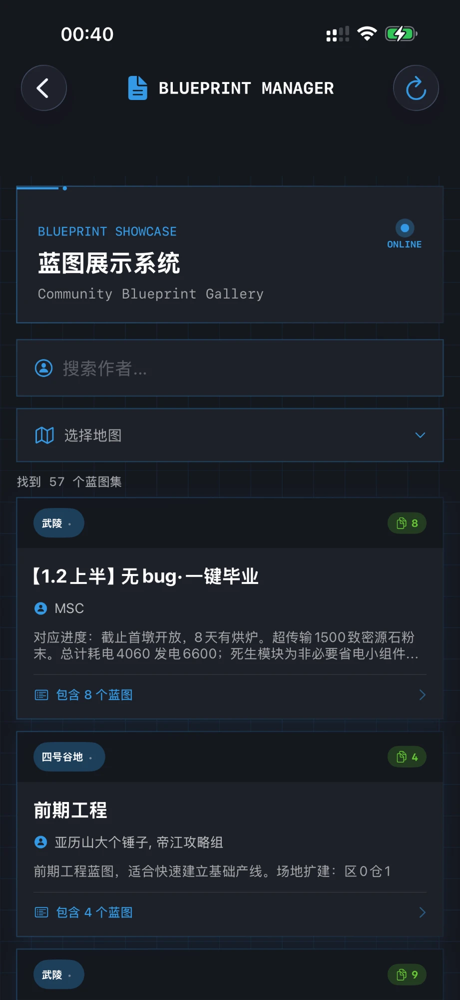
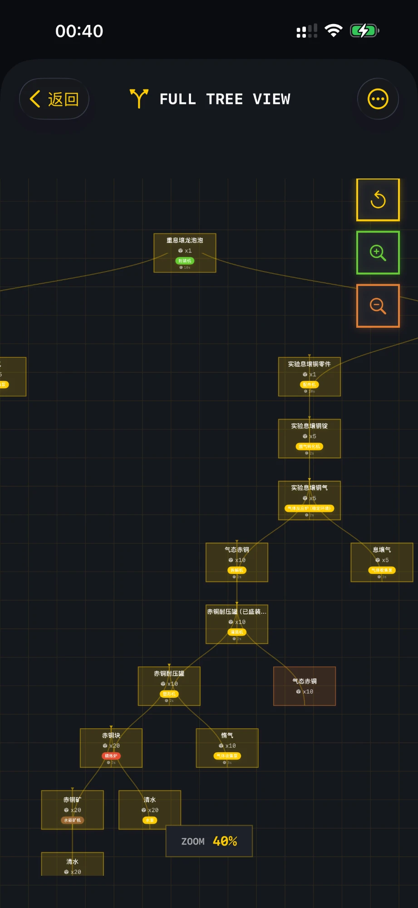

<div align="center">


# Endfield Planner · 终末地生产规划

**《明日方舟：终末地》玩家自制的生产规划工具（iOS / iPadOS）**

配方链分析 · 基建蓝图码收录 · 基建布局规划与产能模拟


[GitHub](https://github.com/JinjiaOu/Endfiled-Planner) · [Gitee（国内镜像）](https://gitee.com/JinjiaOu/endfield--planner)

</div>

---

## 截图

<table>
  <tr>
    <td align="center"><br><sub>基建规划 · 利用率视图</sub></td>
    <td align="center"><br><sub>基建规划 · 产能统计</sub></td>
    <td align="center"><br><sub>蓝图码管理</sub></td>
    <td align="center"><br><sub>配方分析 · 配方树</sub></td>
  </tr>
</table>

---

## 功能

### 🔍 配方分析系统
- 搜索物品（带联想和搜索历史）或从完整物品列表里挑选，设定目标数量，展开完整的**生产配方树**
- 自动挑选最合适的配方（优先避开互相依赖的循环配方），显示每一级所需原料数量和耗时
- 配方树可缩放浏览，适合规划一条产线到底要准备多少原料

### 📋 蓝图码管理系统
- 收录社区作者分享的基建蓝图码，按**四号谷地 / 武陵**分区，可按作者搜索
- 每套蓝图带说明：产物、消耗、效率、占地、摆放顺序和注意事项，一键复制蓝图码
- 数据放在仓库里的 [`blueprints.json`](EndfiledPlanner/BluePrint/blueprints.json)，App 优先从 Gitee / GitHub 读取最新版，**更新蓝图不需要发新版 App**，在蓝图页点刷新即可拿到

### 🏭 基建规划（生产优化模块）
在网格画布上自由摆放建筑、拉传送带和管道，App 会实时模拟整套基建的稳定产能。

**摆放与编辑**
- 建筑数据、端口位置、配方均来自游戏数据表；建造面板按分类筛选，按住拖到画布放置
- 画传送带 / 管道：拖动即走 L 形路线，自动吸附建筑端口，同类线十字交叉自动放物流桥
- 移动、旋转建筑时，接在它身上的线会跟着重新走线
- **框选**一组建筑和线，整组移动 / 删除；拖到画面边缘自动滚动
- **我的布局**：把框选的一组存成布局（带全部配方和设置），之后可整组放到任意位置、整体旋转，跨地图放置会提前提醒冲突
- 完整的撤销 / 重做

**产能模拟**
- 按带速 / 管速、分流器（堵住一路会匀给其它路）、汇流器、准入口（限速 + 只放行某种物品）逐级推算每台机器的实际运行率
- 机器状态一目了然：生产中 / 原料不足 / 阻塞 / 未激活，并给出原因（比如"被物品准入口挡住（只放行 B）"）
- 反应池、扩容反应池的多配方自我供给；转化机、气体散布机的激活与环境
- 电力：供电桩覆盖范围、热能池按燃料算发电、协议核心固定发电；电力不足或建筑没通电时画布上直接提示
- 仓库取货口 / 存货口、地下暗管、协议核心出货口（每个口单独选出什么）
- **利用率视图**：传送带和管道按流量 / 上限上色，跑满、没跑满（标百分比）、空闲、被限流（瓶颈）一眼看出
- 产能统计：总产出、总消耗、耗电与发电、瓶颈建筑

**地图规则**
- 四号谷地与武陵分别按游戏规则限制：武陵专属建筑、四号谷地只能用基础模式配方、四号谷地不能用管道、两张图不同的仓库取线方式
- 规则随时重新检查，不合规的建筑会标红并不参与计算
- 内置两套预设产线（四号谷地高容电池、武陵灼铜装备原件），可一键载入参考

---

## 构建与运行

需要支持 iOS 26 SDK 的 Xcode。

```bash
git clone https://github.com/JinjiaOu/Endfiled-Planner.git
cd Endfiled-Planner
open EndfiledPlanner.xcodeproj
```

选择 `EndfiledPlanner` scheme 和 iPhone / iPad 模拟器（或真机），运行即可。项目没有第三方依赖。

> 在 Xcode 里运行时首次打开会稍慢（调试器附着 + 首次启动），从桌面直接打开不受影响。

---

## 项目结构

```
EndfiledPlanner/
├── RecipeSearch/            配方分析：配方数据加载、物品目录、配方树视图
├── BluePrint/               蓝图码管理：blueprints.json 及远端加载、缓存
├── ProductionOptimizer/     基建规划
│   ├── ViewModel/           网格模型、产能模拟器（FlowSimulator）、地图规则（MapRules）、
│   │                        框选 / 我的布局 / 放置等
│   └── View/                画布、建造面板、建筑与管线详情、产能统计
└── other/                   App 入口、主页、设置；游戏数据 JSON 与物品图标

Tools/                       数据与资源生成脚本（Python）
├── gen_datapack.py          从游戏解包表格生成 devices / recipes / items / fuels 等 JSON
├── gen_icons.py             生成物品图标资源目录
├── gen_presets.py           复刻 App 的摆放与模拟规则，生成并校验内置预设产线
├── presetlib.py             上面脚本用到的规则复刻（改模拟规则时要同步）
└── blueprint_import/        把社区蓝图表格（xlsx）整理进 blueprints.json
```

## 数据来源

- 建筑、配方、物品、燃料等数据由 `Tools/gen_datapack.py` 从游戏解包的数据表生成（解包数据本身不包含在仓库里）
- 带速、管速、供电范围、发电量等数值取自数据表，并在游戏内实测核对
- 蓝图码来自社区作者的公开分享，作者署名保留在每套蓝图上

## 投稿蓝图

蓝图数据就是 [`EndfiledPlanner/BluePrint/blueprints.json`](EndfiledPlanner/BluePrint/blueprints.json)。想补充或修正蓝图，欢迎提 Issue 或 Pull Request，注明蓝图名称、蓝图码、作者和适用地图。合并后所有用户在蓝图页刷新就能看到。

---

## 致谢

感谢以下作者公开分享蓝图（排名不分先后）：MSC、萧然Q、魔法Zc目录、流星飞、亚历山大个锤子 / 帝江攻略组、自在道爷，以及 App 内注明的各模块作者。

## 免责声明

本项目为玩家自制的非官方工具，与鹰角网络（Hypergryph）及《明日方舟：终末地》官方无任何关联。游戏名称、数据、图标等相关内容的版权归其各自所有者所有。蓝图版权归原作者所有，如有侵权或希望移除，请提 Issue 联系。
